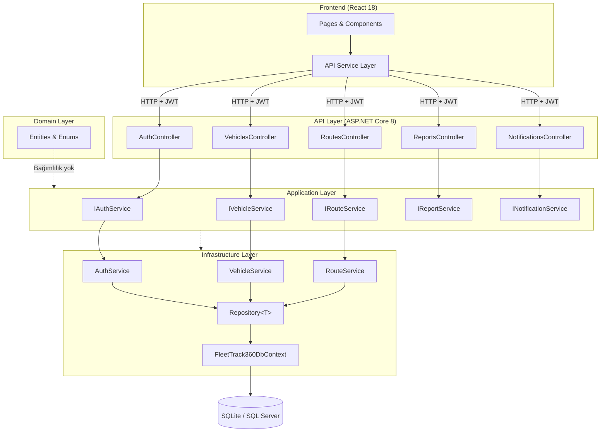
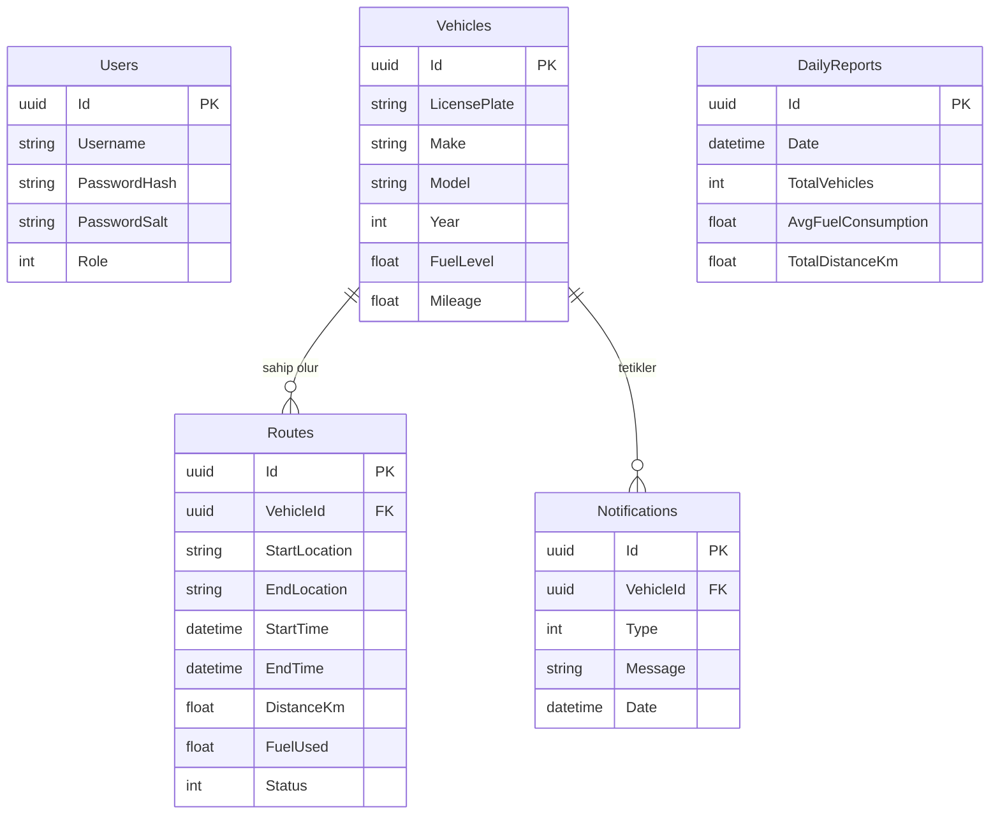
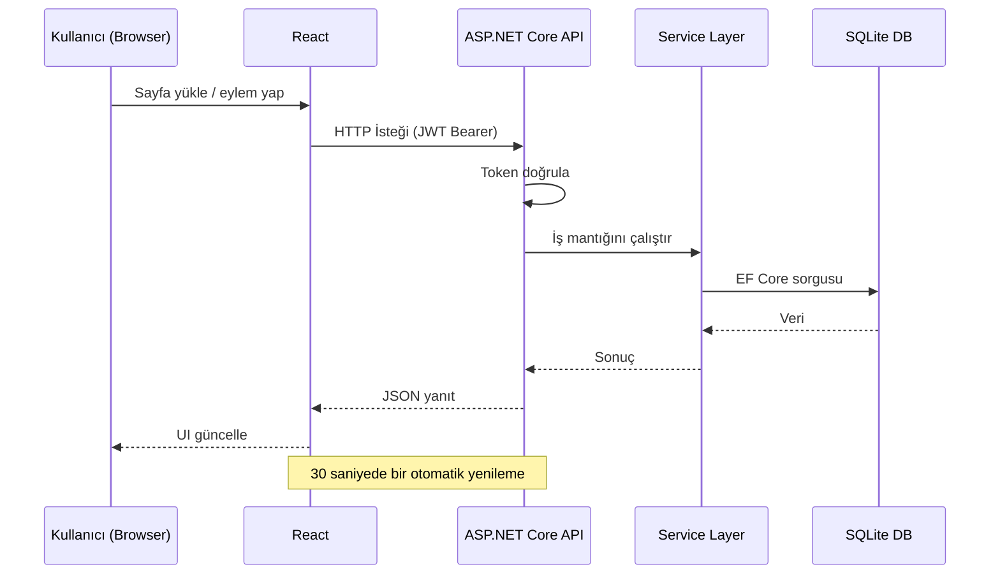
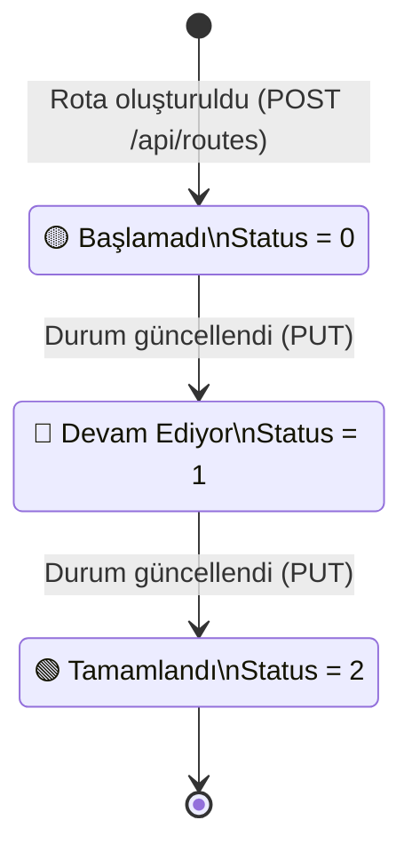

# FleetTrack360

<div align="center">


**Gerçek zamanlı filo ve rota yönetim platformu.**
.NET 8 + React ile Clean Architecture üzerine inşa edilmiştir.

</div>

---

## İçindekiler

- [Genel Bakış](#genel-bakış)
- [Mimari](#mimari)
- [Veritabanı Şeması](#veritabanı-şeması)
- [Veri Akışı](#veri-akışı)
- [Geliştirme Fazları](#geliştirme-fazları)
- [Kurulum](#kurulum)
- [API Referansı](#api-referansı)
- [Teknoloji Yığını](#teknoloji-yığını)

---

## Genel Bakış

FleetTrack360, araç filolarını takip etmek, rotaları yönetmek ve yakıt verimliliğini analiz etmek için tasarlanmış tam yığın bir uygulamadır. Dashboard 30 saniyede bir otomatik yenilenir; tüm operasyonlar doğrudan veritabanıyla senkronize çalışır.

**Temel Yetenekler:**

- Araç takibi — yakıt seviyesi, kilometre, rota geçmişi
- Rota yaşam döngüsü yönetimi — `Başlamadı → Devam Ediyor → Tamamlandı`
- Günlük yakıt verimliliği ve mesafe analitiği
- Bildirim sistemi — düşük yakıt ve rota sapması uyarıları
- JWT tabanlı kimlik doğrulama

---

## Mimari



### Proje Yapısı

```
FleetTrack360/
├── src/
│   ├── FleetTrack360.Domain/          # Entities, Enums
│   ├── FleetTrack360.Application/     # Service Interfaces
│   ├── FleetTrack360.Infrastructure/  # EF Core, Repositories, Services
│   └── FleetTrack360.API/             # Controllers, Program.cs
├── frontend/
│   └── src/
│       ├── pages/        # Dashboard, Vehicles, Routes, Reports, Notifications
│       ├── components/   # Layout, ortak bileşenler
│       └── services/     # api.js — Axios istemcisi
└── tests/
    └── FleetTrack360.Tests/
```

---

## Veritabanı Şeması



---

## Veri Akışı



### Rota Yaşam Döngüsü



---

## Geliştirme Fazları

### Faz 1 — Temel Altyapı ✅

> Proje iskeleti ve temel CRUD operasyonları

- [x] Clean Architecture kurulumu (Domain / Application / Infrastructure / API)
- [x] Entity Framework Core entegrasyonu (SQLite & SQL Server desteği)
- [x] Generic `Repository<T>` implementasyonu
- [x] Araç, Rota, Bildirim ve Rapor servisleri
- [x] REST API controller'ları
- [x] React frontend — Dashboard, Vehicles, Routes, Reports, Notifications sayfaları
- [x] Recharts ile yakıt verimliliği ve rota aktivite grafikleri
- [x] 30 saniyelik otomatik dashboard yenileme
- [x] Seed data ile geliştirme ortamı kurulumu

### Faz 2 — Güvenlik & Kalite ✅

> Kimlik doğrulama, şifreleme ve veri doğrulama

- [x] PBKDF2 (100k iterasyon) + rastgele salt ile güvenli şifre hashleme
- [x] Gerçek JWT token üretimi — HMAC-SHA256, 8 saatlik geçerlilik
- [x] `ValidateIssuerSigningKey` ve `ValidateLifetime` aktif edildi
- [x] JWT Secret ortam değişkeni / config'ten okunuyor (hardcoded değil)
- [x] Controller input validation — boş alan, aralık ve mantık kontrolleri
- [x] Axios request interceptor — her isteğe otomatik Bearer token ekleme
- [x] Axios response interceptor — 401'de token temizleme
- [x] Frontend filter bug'ları düzeltildi (Notifications, Routes)
- [x] Veritabanı dosyaları `.gitignore`'a alındı
- [x] `appsettings.json`, `.env`, gizli dosyalar gitignore'da

### Faz 3 — Özellik Genişletme 🔄 *(Planlı)*

> Kullanıcı deneyimi ve operasyonel özellikler

- [ ] Giriş / kayıt sayfası (Login/Register UI)
- [ ] JWT yenileme token (refresh token) mekanizması
- [ ] Kullanıcı rolü bazlı yetkilendirme (`Admin` / `Driver`)
- [ ] Araç bazlı rota geçmişi sayfası
- [ ] Bildirim okundu/okunmadı durumu
- [ ] Pagination — araç ve rota listeleri için
- [ ] CSV/Excel rapor dışa aktarma
- [ ] Düşük yakıt otomatik bildirim tetikleyicisi

### Faz 4 — Üretim Hazırlığı 🔄 *(Planlı)*

> Ölçeklenebilirlik, gözlemlenebilirlik ve dağıtım

- [ ] Rate limiting — auth endpoint'lerine brute-force koruması
- [ ] Serilog ile yapılandırılmış loglama
- [ ] Birim ve entegrasyon testleri
- [ ] Docker & docker-compose konfigürasyonu
- [ ] GitHub Actions CI/CD pipeline
- [ ] Health check endpoint'leri
- [ ] HTTPS zorunlu kılınması (üretimde)

---

## Kurulum

### Gereksinimler

| Araç | Versiyon |
|------|---------|
| .NET SDK | 8.0+ |
| Node.js | 16+ |
| npm | 8+ |

### 1. Repoyu Klonla

```bash
git clone https://github.com/harunidev/FleetTrack360.git
cd FleetTrack360
```

### 2. Backend Yapılandırması

`appsettings.json.example` dosyasını kopyala:

```bash
cp src/FleetTrack360.API/appsettings.json.example src/FleetTrack360.API/appsettings.json
```

`appsettings.json` içindeki değerleri düzenle:

```json
{
  "ConnectionStrings": {
    "DefaultConnection": "SQLite"
  },
  "Jwt": {
    "Secret": "EN_AZ_32_KARAKTER_GUCLU_BIR_SECRET_YAZIN"
  }
}
```

> **Not:** `DefaultConnection` değeri `"SQLite"` bırakılırsa uygulama SQLite kullanır ve `fleettrack360.db` dosyasını otomatik oluşturur.

### 3. Backend'i Başlat

```bash
cd src/FleetTrack360.API
dotnet restore
dotnet run
```

Backend `http://localhost:5000` adresinde çalışır.
Swagger UI: `http://localhost:5000/swagger`

### 4. Frontend'i Başlat

```bash
cd frontend
npm install
npm start
```

Frontend `http://localhost:3000` adresinde açılır.

---

## API Referansı

### Auth

| Method | Endpoint | Açıklama |
|--------|----------|----------|
| `POST` | `/api/auth/register` | Kullanıcı kaydı |
| `POST` | `/api/auth/login` | Giriş — JWT döner |

### Araçlar

| Method | Endpoint | Açıklama |
|--------|----------|----------|
| `GET` | `/api/vehicles` | Tüm araçları listele |
| `GET` | `/api/vehicles/{id}` | Araç detayı |
| `POST` | `/api/vehicles` | Yeni araç ekle |
| `PUT` | `/api/vehicles/{id}` | Araç güncelle |
| `DELETE` | `/api/vehicles/{id}` | Araç sil |

### Rotalar

| Method | Endpoint | Açıklama |
|--------|----------|----------|
| `GET` | `/api/routes` | Tüm rotaları listele |
| `GET` | `/api/routes/{id}` | Rota detayı |
| `GET` | `/api/routes/vehicle/{vehicleId}` | Araca ait rotalar |
| `POST` | `/api/routes` | Yeni rota oluştur |
| `PUT` | `/api/routes/{id}` | Rota güncelle / durum değiştir |

### Bildirimler & Raporlar

| Method | Endpoint | Açıklama |
|--------|----------|----------|
| `GET` | `/api/notifications` | Tüm bildirimleri listele |
| `POST` | `/api/notifications` | Bildirim oluştur |
| `GET` | `/api/reports/daily` | Günlük rapor |

---

## Teknoloji Yığını

### Backend

| Teknoloji | Versiyon | Amaç |
|-----------|---------|------|
| .NET | 8.0 | Framework |
| ASP.NET Core | 8.0 | Web API |
| Entity Framework Core | 8.0 | ORM |
| SQLite / SQL Server | — | Veritabanı |
| JWT Bearer | 8.0 | Kimlik doğrulama |
| Swagger / OpenAPI | 6.5 | API dokümantasyonu |

### Frontend

| Teknoloji | Versiyon | Amaç |
|-----------|---------|------|
| React | 18.2 | UI framework |
| React Router | 6.3 | Navigasyon |
| Axios | 1.4 | HTTP istemcisi |
| Recharts | 2.7 | Grafik / veri görselleştirme |
| Tailwind CSS | 3.3 | Stil |
| Lucide React | 0.263 | İkon seti |

---

## Katkı

Pull request'ler kabul edilir. Büyük değişiklikler için önce bir issue açmanız önerilir.

## Yazar

**harunidev** — [github.com/harunidev](https://github.com/harunidev)
